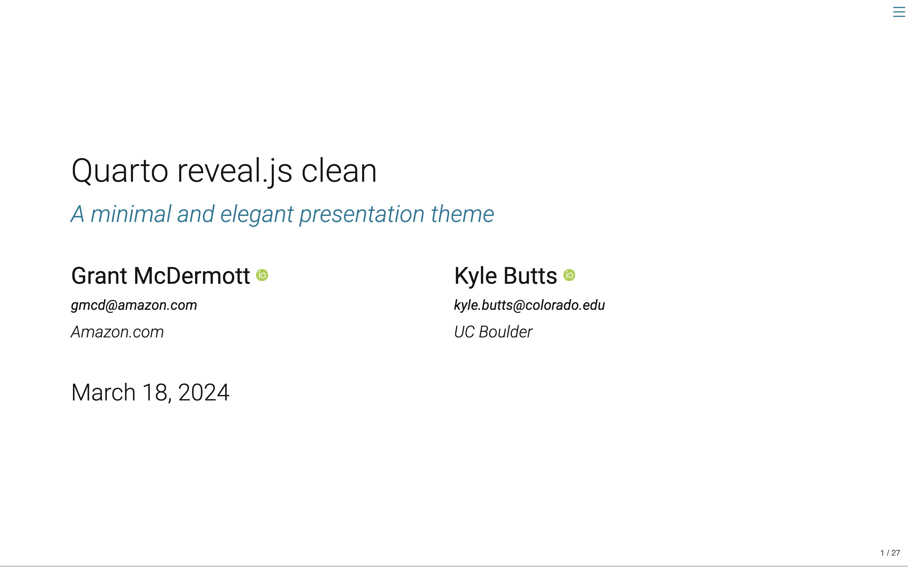

# Quarto clean theme

A minimalist and elegant presentation theme for Quarto Reveal.js, inspired by Kyle's
[LaTex template](https://raw.githack.com/kylebutts/templates/master/latex-slides/slides.pdf).

Click the screenshot below to be taken to a
[live demo](https://grantmcdermott.com/quarto-revealjs-clean-demo/template.html).

[](https://grantmcdermott.com/quarto-revealjs-clean-demo/template.html)

## Use

Depending on your use case, here are some [Quarto CLI](https://quarto.org/)
commands to get started.

If you would like to add the **clean** theme to an existing directory:

```bash
quarto install extension grantmcdermott/quarto-revealjs-clean
```

Alternatively, you can use a
[Quarto template](https://quarto.org/docs/extensions/starter-templates.html)
that bundles the **clean** theme plus a .qmd starter document. This is a better
option if you are starting a new project from scratch, since it will automatically
create a new directory with all of the necessary scaffolding in one go. We provide
two template options.

- Bare bones template

```bash
quarto use template grantmcdermott/quarto-revealjs-clean
```

- Full demo template

```bash
quarto use template grantmcdermott/quarto-revealjs-clean-demo
```

## PDF (Typst) version

The Quarto Reveal.js backend will render HTML slides. This is great for
interactive content and dynamic responsiveness (e.g., automatically fitting
whatever display device is being used). However, you may prefer to render your
slides directly to PDF instead. If so, please take a look at Kazuharu
Yanagimoto's very nice port of the **clean** theme, which leverages the Typst
backend: https://github.com/kazuyanagimoto/quarto-clean-typst