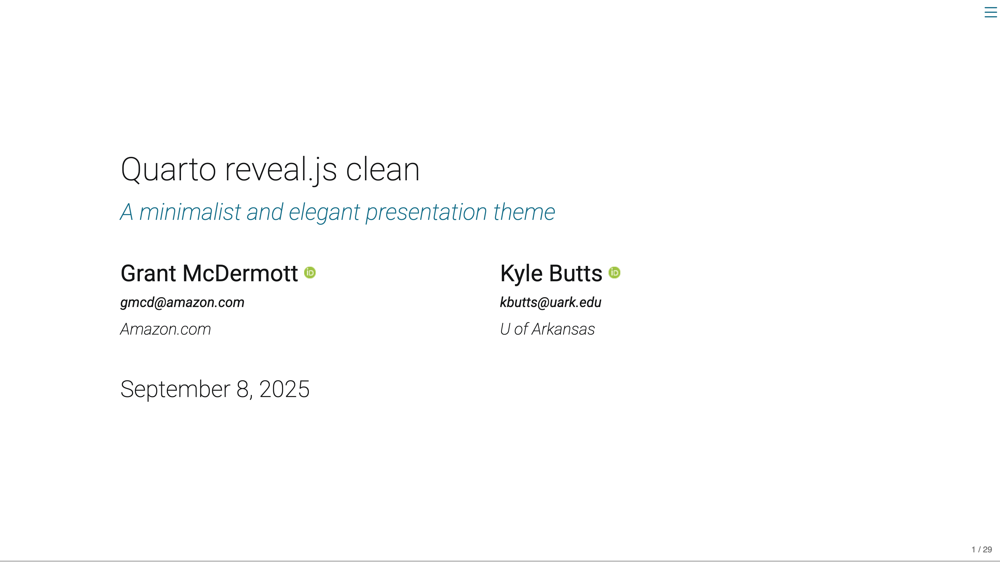

# Quarto clean theme

A clean and elegant presentation theme for Quarto Reveal.js, inspired by Kyle's
[LaTex template](https://raw.githack.com/kylebutts/templates/master/latex-slides/auxiliary/slides.pdf).

 

## Installing

Use the following [Quarto CLI](https://quarto.org/) command to install the theme.

```bash
quarto install extension grantmcdermott/quarto-revealjs-clean
```

## Example

Here is the source code for a minimal sample document: [template.qmd](template.qmd).
